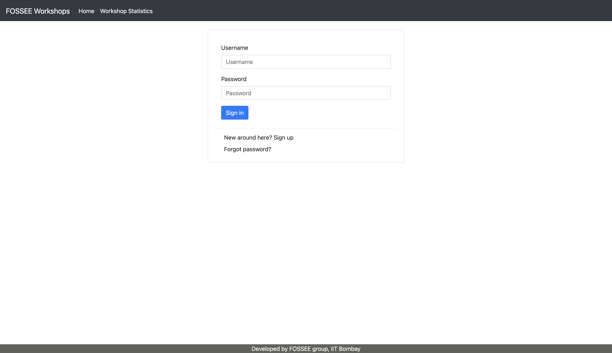
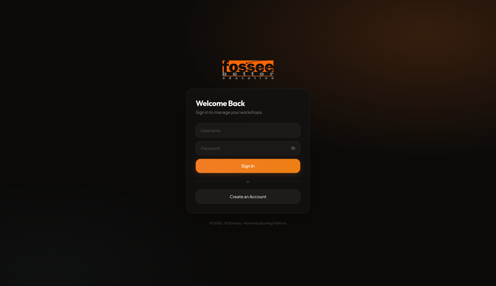
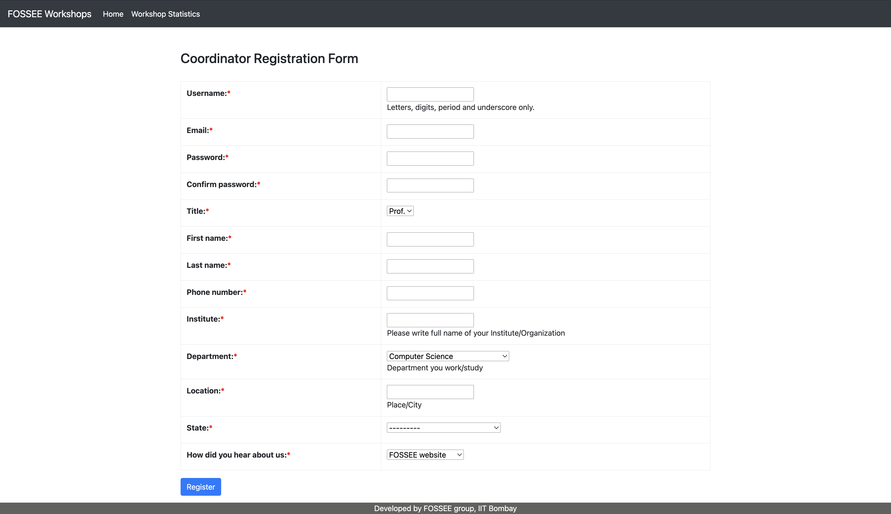
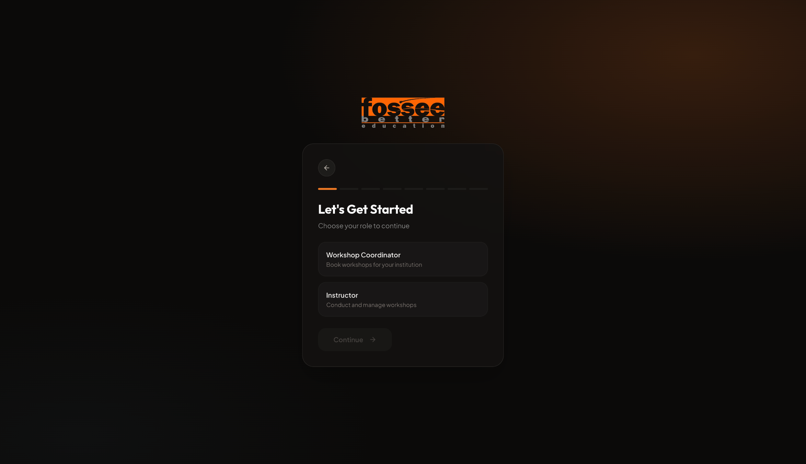
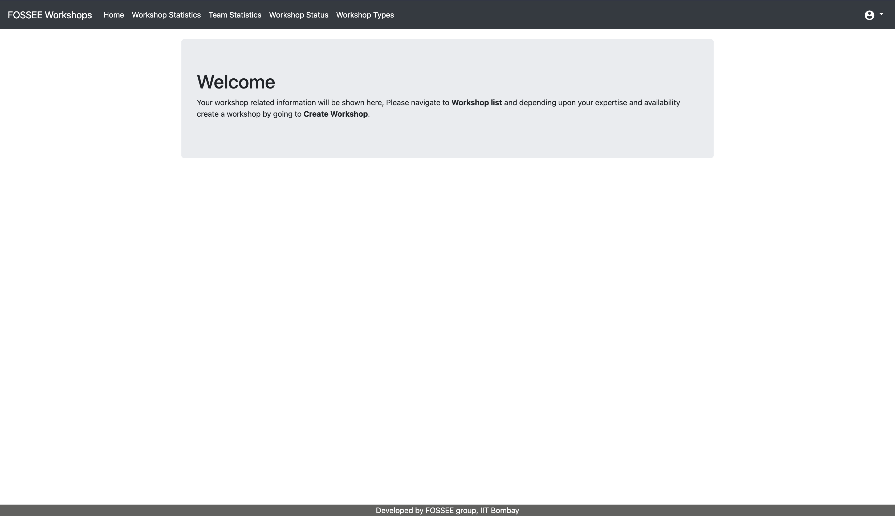
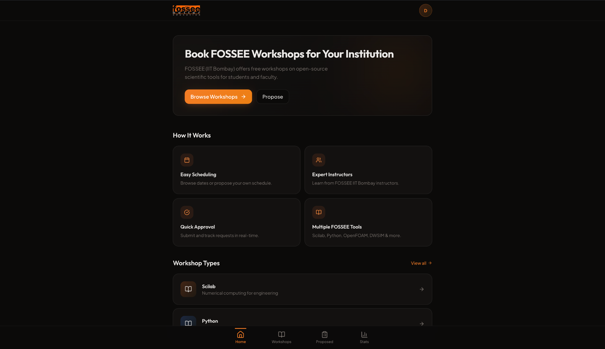
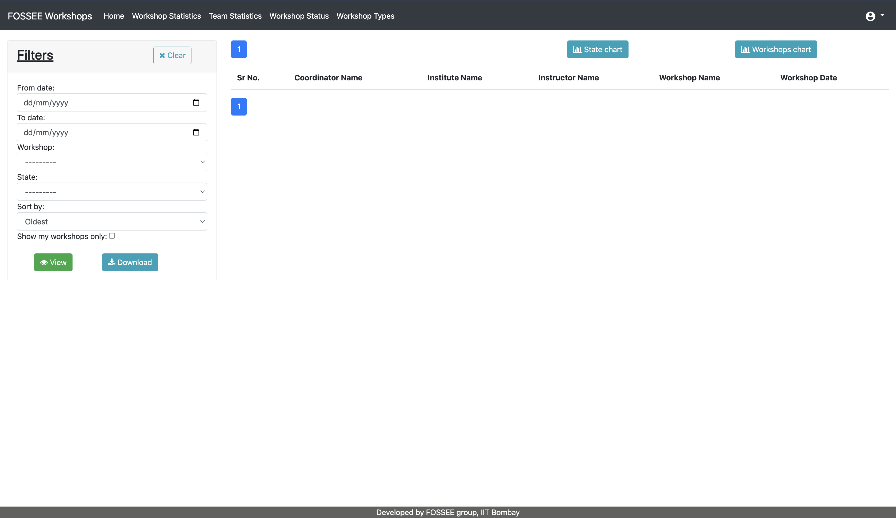
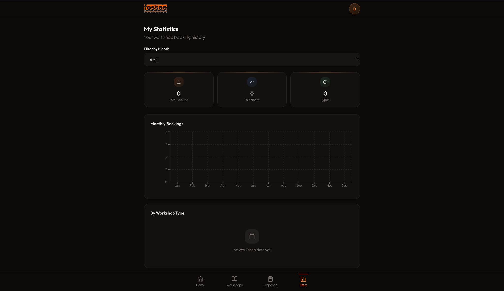
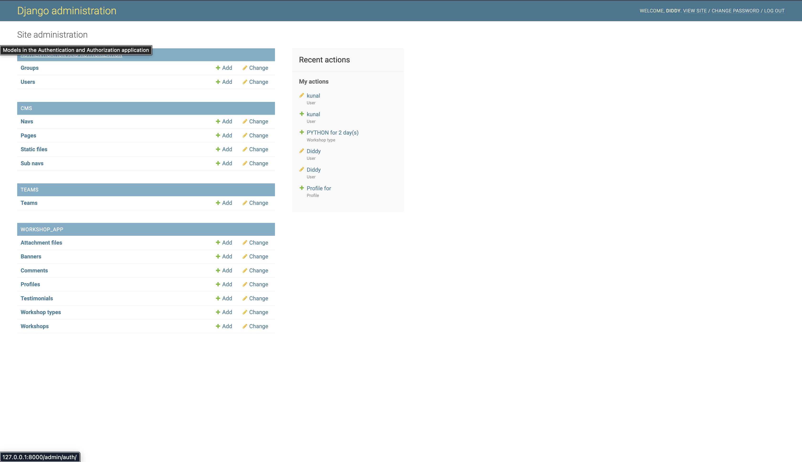
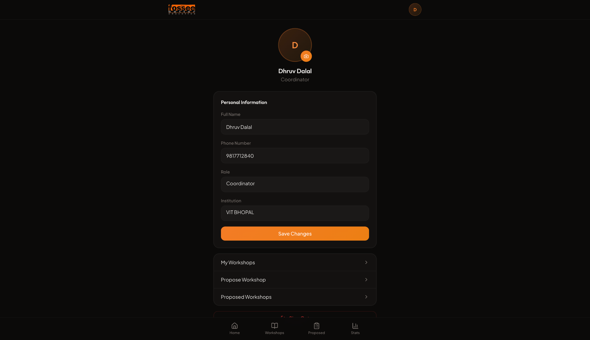

# FOSSEE Workshop Booking — UI/UX Redesign

A modern, mobile-first redesign of the [FOSSEE Workshop Booking](https://github.com/FOSSEE/workshop_booking) platform, built with **React 18**, **TypeScript**, **Tailwind CSS**, and **Vite**.  
The original Django backend is preserved while the frontend has been completely enhanced for better UI/UX.

**Live Demo:** [FOSSEE Workshop](https://fossee-workshops.netlify.app)

---

##  UI/UX Improvements

> The redesign focuses on improving usability, accessibility, and mobile responsiveness while keeping the core functionality intact.  
> Below are before-and-after comparisons along with the reasoning behind each improvement.

---

###  Login Page
| Before | After |
|--------|-------|
| <p align="center"></p> | <p align="center"></p> |

**What was changed:**
- Replaced basic Bootstrap form with a modern glassmorphic UI  
- Improved spacing, alignment, and CTA visibility  
- Added branding and gradient-based visual depth  

**Impact:**
- Stronger first impression and visual appeal  
- Better input focus and readability  
- More engaging and intuitive login experience  

---

###  Registration / Onboarding
| Before | After |
|--------|-------|
| <p align="center"></p> | <p align="center"></p> |

**What was changed:**
- Converted long static form into a step-by-step onboarding flow  
- Introduced role selection (Coordinator / Instructor)  
- Reduced visible fields at once  

**Impact:**
- Lower cognitive load  
- Increased user engagement  
- Smoother and more guided user flow  

---

###  Dashboard
| Before | After |
|--------|-------|
| <p align="center"></p> | <p align="center"></p> |

**What was changed:**
- Redesigned layout with modern UI components  
- Introduced bottom navigation for mobile-first usage  
- Improved spacing, typography, and structure  

**Impact:**
- Faster navigation on mobile devices  
- Better content organization  
- Cleaner and distraction-free interface  

---

###  Workshop Statistics
| Before | After |
|--------|-------|
| <p align="center"></p> | <p align="center"></p> |

**What was changed:**
- Replaced tabular data with visual charts and cards  
- Added filtering and structured layout  
- Improved data grouping  

**Impact:**
- Easier data interpretation  
- More interactive experience  
- Better decision-making support  

---

###  Profile / User Interface
| Before | After |
|--------|-------|
| <p align="center"></p> | <p align="center"></p> |

**What was changed:**
- Replaced admin-heavy UI with clean user profile screen  
- Structured personal information layout  
- Added clear action buttons  

**Impact:**
- More intuitive user interaction  
- Improved clarity and usability  
- Better overall user experience  

---

###  Summary of Improvements

- Mobile-first responsive design  
- Reduced cognitive load across flows  
- Improved navigation and accessibility  
- Modern visual design aligned with current UI trends  
- Faster and cleaner user interactions  
---

##  Reasoning

###  Design Principles

- **Mobile-First Approach**  
  The platform is primarily used by students on mobile devices, so all layouts were designed starting from small screens. Navigation, spacing, and components were optimized for touch interactions and readability.

- **Clear Visual Hierarchy**  
  A consistent typographic system and spacing structure were used to guide user attention. Important actions like buttons and active states are highlighted using FOSSEE’s accent color, improving clarity and usability.

- **Role-Based UX**  
  Coordinators and Instructors have different workflows, so the interface adapts based on user roles. This ensures users only see relevant features, reducing confusion and improving efficiency.

- **Simplified User Flow**  
  The original long forms were replaced with a step-by-step onboarding experience. This makes the process feel lighter, reduces cognitive load, and improves completion rates.

- **Accessibility Considerations**  
  Semantic HTML, proper labeling, and sufficient color contrast were used to ensure the interface is usable for a wider range of users.

---

###  Responsiveness

- **Mobile-first approach**  
  The interface was designed starting from small screen sizes and then scaled up for larger devices. This ensures the core experience is optimized for mobile users, who form the majority of the audience.

- **Flexible layouts**  
  Grid and container-based layouts were used to allow components to adapt naturally across different screen sizes. This ensures the UI remains structured and usable on both small and large devices.

- **Consistent UI scaling**  
  Spacing, typography, and alignment were carefully maintained across breakpoints to provide a consistent look and feel, preventing layout shifts or clutter on different screens.

- **Touch-friendly design**  
  Interactive elements such as buttons and inputs were sized and spaced appropriately to support touch interactions, improving usability on mobile devices.

- **Cross-device testing**  
  The interface was tested across multiple screen sizes (mobile, tablet, desktop) to ensure consistent behavior, readability, and usability in real-world scenarios.

---

###  Design vs Performance Trade-offs

- **CSS Gradients over Images**  
  Instead of using high-resolution background images, CSS gradients were used to achieve a similar visual effect. This reduces network requests and improves load time, but slightly limits the richness of visual textures.

- **Controlled Use of Visual Effects**  
  Effects like blur and shadows were applied selectively rather than throughout the interface. This maintains a modern look while preventing unnecessary GPU load, especially on lower-end devices.

- **Lightweight Animations**  
  CSS-based transitions were used instead of heavy animation libraries. This ensures smooth interactions with minimal performance overhead, although it limits the complexity of animations.

- **Efficient Component Design**  
  UI components were kept simple and reusable to reduce rendering complexity. This improves performance and maintainability, but avoids overly complex visual components.

- **Performance-First Decisions**  
  Design choices were made with a focus on speed and usability rather than adding excessive visual elements. This ensures a faster and more responsive application, even if it means sacrificing some advanced UI effects.

---

###  Challenges & Approach

- **Designing Multi-step Registration Flow**  
  The original form had many fields on a single page, making it overwhelming for users. This was redesigned into a step-by-step flow by grouping related fields and guiding users progressively, improving usability and completion experience.

- **Implementing Role-Based Navigation**  
  Different user roles required different interfaces, which made it challenging to avoid code duplication. This was handled using a shared layout with conditional rendering, allowing dynamic UI changes based on user roles.

- **Balancing Modern UI with Performance**  
  Creating a visually appealing interface while maintaining performance was a key challenge. This was addressed by using lightweight design techniques, limiting heavy effects, and avoiding unnecessary dependencies to ensure smooth interaction.

##  Project Structure

```
├── public/                          # Static assets
│   ├── fossee-favicon.png           # FOSSEE favicon
│   ├── fossee-logo-full.png         # FOSSEE full logo
│   └── robots.txt
├── src/
│   ├── assets/                      # Bundled assets (images, etc.)
│   ├── components/
│   │   ├── layout/
│   │   │   ├── DashboardLayout.tsx   # Role-based bottom-tab layout
│   │   │   ├── Footer.tsx
│   │   │   ├── Header.tsx
│   │   │   └── Layout.tsx            # Public page layout
│   │   ├── ui/                       # shadcn/ui components
│   │   ├── NavLink.tsx
│   │   └── ThemeProvider.tsx
│   ├── contexts/
│   │   └── UserContext.tsx           # Auth state & role management
│   ├── hooks/
│   │   ├── use-mobile.tsx
│   │   └── useScrollAnimation.ts
│   ├── lib/
│   │   └── utils.ts                 # Tailwind merge utility
│   ├── pages/
│   │   ├── Auth.tsx                  # Login + multi-step registration
│   │   ├── Index.tsx                 # Home dashboard (role-based)
│   │   ├── Workshops.tsx             # Workshop listing
│   │   ├── WorkshopDetails.tsx       # Single workshop view
│   │   ├── ProposeWorkshop.tsx       # Workshop proposal form
│   │   ├── CreateWorkshop.tsx        # Workshop creation (instructor)
│   │   ├── ProposedWorkshops.tsx     # Proposed workshop tracking
│   │   ├── Statistics.tsx            # Stats & analytics
│   │   ├── Comments.tsx              # Comment feed (instructor)
│   │   ├── Profile.tsx               # User profile & settings
│   │   └── NotFound.tsx
│   ├── App.tsx                       # Route definitions
│   ├── index.css                     # Design tokens & global styles
│   └── main.tsx                      # Entry point
├── workshop_app/                     # Django backend (original)
│   ├── models.py                     # Data models (Workshop, Profile, etc.)
│   ├── views.py                      # View logic
│   ├── urls.py                       # URL routing
│   ├── forms.py                      # Django forms
│   ├── templates/                    # Django templates (legacy)
│   ├── static/                       # Static files (CSS, JS, fonts)
│   ├── migrations/                   # Database migrations
│   └── tests/                        # Unit tests
├── workshop_portal/                  # Django project settings
│   ├── settings.py
│   ├── urls.py
│   └── wsgi.py
├── statistics_app/                   # Statistics module (Django)
├── cms/                              # CMS module (Django)
├── teams/                            # Teams module (Django)
├── manage.py                         # Django management
├── requirements.txt                  # Python dependencies
├── package.json                      # Node.js dependencies
├── vite.config.ts                    # Vite configuration
├── tailwind.config.ts                # Tailwind configuration
├── tsconfig.json                     # TypeScript configuration
└── README.md
```

---

##  Setup Instructions

### Prerequisites

- **Node.js** ≥ 18
- **Python** ≥ 3.8 (for Django backend)
- **pip** (Python package manager)

### Frontend (React)

```bash
# Clone the repository
git clone https://github.com/YOUR_USERNAME/workshop_booking.git
cd workshop_booking

# Install Node.js dependencies
npm install

# Start the development server
npm run dev
```

The React app will be available at `http://localhost:5173`.

### Backend (Django)

```bash
# Create a virtual environment
python3 -m venv venv
source venv/bin/activate  # On Windows: venv\Scripts\activate

# Install Python dependencies
pip install -r requirements.txt

# Run database migrations
python manage.py migrate

# Create a superuser (optional)
python manage.py createsuperuser

# Start the Django server
python manage.py runserver
```

The Django backend will be available at `http://localhost:8000`.

### Connecting Frontend to Backend

To connect the React frontend with the Django backend during development, add a proxy to `vite.config.ts`:

```ts
export default defineConfig({
  server: {
    proxy: {
      '/api': {
        target: 'http://localhost:8000',
        changeOrigin: true,
      },
    },
  },
});
```

Then use `fetch('/api/...')` in React components to call Django endpoints.

---

##  Tech Stack

| Layer | Technology |
|-------|------------|
| Frontend | React 18, TypeScript 5, Vite 5 |
| Styling | Tailwind CSS 3, shadcn/ui |
| State | React Context API, TanStack Query |
| Charts | Recharts |
| Routing | React Router v6 |
| Backend | Django 3.x (original, preserved) |
| Database | SQLite (default) / PostgreSQL |

---


## 📄 License

This project is part of the FOSSEE initiative at IIT Bombay. See [LICENSE](LICENSE) for details.
